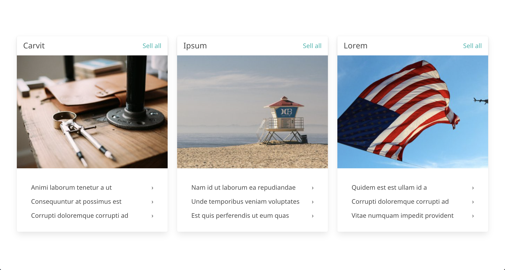

<p align="center">

  <h3 align="center">WP Fizz Builder</h3>

  <p align="center">
    A Page Builder for WordPress Developers, based on Timber & ACF PRO
    <br />
    <a href="https://github.com/jeremy6680/wp-fizz-builder"><strong>Explore the docs »</strong></a>
    <br />
    <br />
    <a href="https://github.com/jeremy6680/wp-fizz-builder">View Demo</a>
    ·
    <a href="https://github.com/jeremy6680/wp-fizz-builder/issues">Report Bug</a>
    ·
    <a href="https://github.com/jeremy6680/wp-fizz-builder/issues">Request Feature</a>
  </p>
</p>


<!-- TABLE OF CONTENTS -->
<details open="open">
  <summary><h2 style="display: inline-block">Table of Contents</h2></summary>
  <ol>
    <li>
      <a href="#about-the-project">About The Project</a>
      <ul>
        <li><a href="#built-with">Built With</a></li>
      </ul>
    </li>
    <li>
      <a href="#getting-started">Getting Started</a>
      <ul>
        <li><a href="#prerequisites">Prerequisites</a></li>
        <li><a href="#installation">Installation</a></li>
      </ul>
    </li>
    <li><a href="#usage">Usage</a></li>
    <li><a href="#roadmap">Roadmap</a></li>
    <li><a href="#contributing">Contributing</a></li>
    <li><a href="#license">License</a></li>
    <li><a href="#contact">Contact</a></li>
    <li><a href="#acknowledgements">Acknowledgements</a></li>
  </ol>
</details>


<!-- ABOUT THE PROJECT -->
## About The Project

**WP Fizz Builder** is a simple **components-based Page Builder for WordPress**. Although it comprises some pre-made components thant can be used on any project, this plugin is mostly aimed at theme/frontend developers, to help us build custom WordPress pages more rapidly and more efficiently.


### Built With

* [Timber](https://github.com/timber/timber): a magnificient plugin that notably allows us to write our HTML using the Twig Template engine, separate from your PHP files.
* [ACF PRO](https://www.advancedcustomfields.com/pro/): in this plugin we make use of the great Flexible Content feature from ACF PRO.
* [Extended ACF](https://github.com/wordplate/extended-acf): a beautiful library that allows us to register ACF groups and fields with object oriented PHP.
* [Bulma](https://bulma.io/): a modern CSS framework that provides ready-to-use frontend components

### What Does This Plugin Do?

This plugin creates a **"Page Builder Template"** (cf [Page Templates in WordPress' Theme Handbook](https://developer.wordpress.org/themes/template-files-section/page-template-files/#creating-custom-page-templates-for-global-use)). 

This template is actually a blank canvas, only displaying the theme's header and theme's footer (it should work with most themes, as long as the theme is using the `header.php` and `footer.php` files). If your theme is already based on Timber, then it should work out of the box if you have a `/views/base.twig` file. 

Choosing this template from [Page Attributes](https://make.wordpress.org/support/user-manual/content/pages/page-attributes/) has two effects:

1. it **removes the default editor** (whether it's Gutenberg or the Classic editor);
2. instead, it brings a **Page Builder**, whose different components can be created using a combination of **ACF** (for the logic) and **Timber** (for the templating part). For more information about this, please refer to the documentation below.

I said this Page Builder is aimed at developers: this is due to the fact this plugin requires custom fields to be declared using oriented object PHP. Among other advantages, using this method avoids useless calls to the database, and prevents errors when maintaining the website. 


<!-- GETTING STARTED -->
## Getting Started

To get a local copy up and running follow these simple steps.

### Prerequisites

You need to have **ACP PRO** *(premium plugin — the license is not included)* and **Timber** *(free plugin)* installed on your website.<br>
If the two plugins are not installed on your site, no worries, you will be prompted from your back office to install and activate them.<br>
**NB.** You're not obliged to use Timber on your whole website. You can just use the templating part for the Page Builder. 

### Installation

1. **Clone the repo**

When using the command line: first, go to your plugins folder:<br>
   ```
   $ cd <myproject>/wp-content/plugins
   ```
Then, run:<br>
```
   $ git clone https://github.com/jeremy6680/wp-fizz-builder.git
```
   
   Alternatively, you can [download the zip](https://github.com/jeremy6680/wp-fizz-builder/archive/refs/heads/main.zip) and upload it to your WordPress website like any other plugin.
   
2. **Install backend dependencies**

When using the command line: first, go to the WP Fizz Builder folder:<br>
```
   $ cd wp-fizz-builder
```
Then, run:<br>
```
   $ composer install
```
This will install the **Extended ACF library**.<br>
If you haven't installed and activated **ACF PRO** and **Timber**, you can do that now, from your WordPress dashboard.<br> 
NB. I didn't include Timber in the composer.json file, but if you prefer, you can install it from the command line:<br>
```
   $ composer require timber/timber
```
   
3. **Install frontend dependencies**

Okay, now let's install the frontend tools we need:

```
   $ npm install
```
   This will notably allow you to use Sass, jQuery, Bulma & BrowserSync when building components for the Page Builder.<br>
If you look at the `/assets` folder, you'll notice a `/src` folder in which you can write your sass and javascript. <br>
The `/dist` folder is missing. Let's create it now:<br>
```
   $ npm run dev
```
In order to use BrowserSync, you'll need to run the following command:<br>
```
   $ npm run watch
```
Finally, to compile your files for production, you'll need to run this:<br>
```
   $ npm run prod
```
In the docs I'll go into more details about how to create/customize components. 

<!-- USAGE EXAMPLES -->
## Usage

The plugin comes pre-packaged with a handful of components ('Hero', '
Title', 'How it works', 'Features', 'Cards').<br>
You're welcome to use them as they are, and you're more than welcome to customize them and create new ones! (that's actually the goal of this plugin: simplify the creation of a component and make it fun, like building a Lego!). 

You'll find the components in a `/components` folder, at the root of the plugin. <br>
Each component includes four files:<br>

* `fields.php`   
* `index.twig`  
* `script.js` 
* `style.scss`

As you can see, each component is an entity in itself; it has its own styles, scripts, logic and layout.

The ACF fields can be written in PHP following [Extended ACF's guideline](https://github.com/wordplate/extended-acf#usage). You can also visit [ACF's offocial documentation](https://www.advancedcustomfields.com/resources/register-fields-via-php/#field-settings) to read more about the different field settings.

Writing the fields in PHP is great — that allows you to commit them in Git (so you won't lose any field) and save you time if you need to install your client's website locally to troubleshoot an issue.

Here's an example of the code I needed to create the fields for the 'Cards' component:<br>


```php
<?php

use Extended\ACF\Fields\Repeater;
use Extended\ACF\Fields\Image;
use Extended\ACF\Fields\Relationship;
use Extended\ACF\Fields\Taxonomy;

return  Repeater::make('Cards')
        ->instructions('Add a card.')
        ->fields([
            Image::make('Image'),
            Taxonomy::make('Category')
                ->instructions('Select one term.')
                ->appearance('select') // checkbox, multi_select, radio or select
                ->returnFormat('object'), // object or id (default)
            Relationship::make('Posts')
            ->instructions('Add posts')
            ->filters([
                'search', 
                'taxonomy'
            ])
            ->elements(['featured_image'])
            ->min(3)
            ->max(3)
            ->returnFormat('object') // id or object (default)
        ])
        ->min(1)
        ->collapsed('card')
        ->buttonLabel('Add a card')
        ->layout('row');
```

Now, here's the **Twig** template (no PHP code!):

```twig

  <section class="{{ classes }} section cards" is="wpf-component-cards" data-{{ block.id }}>
    <div class="container py-4">
      <div class="columns is-multiline">
          
          
          <div class="column is-12 is-4-widescreen">
            <div class="card">
              <div class="card-header">
                <div class="card-header-title">
                  <h5 class="subtitle is-5">{{card.category}}</h5>
                </div>
                <div class="card-header-icon"><a href="{{Term(card.category).link }}">{{ __('Sell all', 'wpf-theme') }}</a></div>
              </div>
              <div class="card-image">
                <a href="{{Term(card.category).link }}"></a>
              </div>
              <div class="card-content">
                <div class="menu">
                  <ul class="menu-list">
                  
                  <li><a href="{{item.link}}"><span>{{item.title}}</span><span class="is-pulled-right">&rsaquo;</span></a></li>
                  
                  </ul>
                </div>
              </div>
            </div>
          </div>
          
      </div>
    </div>
  </section>

```

And here's how it will display on the frontend, after adding some content via the backend:



If you're not familiar with **Twig** in general and **Timber** in particular, I would recommend you to have a look at these two documentations:

* [Twig's documenation](https://twig.symfony.com/)
* [Timber's ACF Cookbook](https://timber.github.io/docs/guides/acf-cookbook/).

Please note that, in order to use this plugin, you don't need to know everything about Timber. You'll mostly need to know how to use **Timber/Twig** with **ACF** (and once you get used to it, there's no going back — it's so fun and addictive!).<br>

Classes you see in the html tags are classes that make **Bulma** display properly. Bulma is a rather light framework, so it doesn't require as many classes as other frontend frameworks such as Bootstrap or Foundation. You can easily add/remove classes and html tags to suit your current project and usual workflow.<br> 

The sass file looks like this:

```sass
// Import variables
//@import '../../../assets/src/scss/custom-variables';

[is="wpf-component-cards"] {
    
}
```       

Two important things to notice:

* in every sass file, we need to import our custom variables (more on this later)
* make sure you namespace every component, so that the code you add in the `.scss` file only concerns the component you're working on.

I haven't added any sass or javascript in these `style.scss` and `script.js` files for this component, but that's where you'll need to add your styles and scripts.

By the way, the javascript and sass will be compiled when you run one of the `npm run`'s commands I mentioned earlier.<br>

Last but not the least: you may not like Bulma's styles. You may just need to use Bulma's grid system. and that's totally fine! in the `/assets/src/scss/_bulma-styles.scss` file, you can choose which Bulma elements you need to important. By default, I included most of them, but if you just want to keep the grid, you can get rid of all of them except for `@import "bulma/sass/grid/columns.sass";` (line #45).

***Note:*** You can actually install the components inside your starter theme or child theme. In order to do so, just copy the `/components` folder and paste it at the root of your starter or child theme. The WP Fizz Builder should work the same. Files in your theme's `/components` folder will be taken into account while the ones in your plugin's `/components` folder will be ignored.

_For more examples, please refer to the upcoming [Documentation](#)_


<!-- ROADMAP -->
## Roadmap

See the [open issues](https://github.com/jeremy6680/wp-fizz-builder/issues) for a list of proposed features (and known issues).


<!-- CONTRIBUTING -->
## Contributing

Contributions are what make the open source community such an amazing place to be learn, inspire, and create. Any contributions you make are **greatly appreciated**.

1. Fork the Project
2. Create your Feature Branch (`git checkout -b feature/AmazingFeature`)
3. Commit your Changes (`git commit -m 'Add some AmazingFeature'`)
4. Push to the Branch (`git push origin feature/AmazingFeature`)
5. Open a Pull Request


<!-- LICENSE -->
## License

Distributed under the MIT License. See `LICENSE` for more information.


<!-- CONTACT -->
## Contact

Jeremy Marchandeau - [@tweetbyjey](https://twitter.com/tweetbyjey) - 

Project Link: [https://github.com/jeremy6680/wp-fizz-builder](https://github.com/jeremy6680/wp-fizz-builder)


<!-- ACKNOWLEDGEMENTS -->
## Acknowledgements

* [Timber](https://upstatement.com/timber/), the plugin that made me love WordPress development
* [ACF PRO](https://www.advancedcustomfields.com/pro/), the *other* plugin that made me love WordPress development!
* [Extended ACF](https://github.com/wordplate/extended-acf)
* [Bulma](https://bulma.io/)